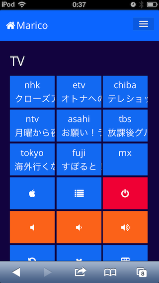

Marico
======

javascriptだけで作るマイリモコン

用意するもの
----
* Raspberry Pi
* USB接続赤外線リモコン(Bit Trade One社製)
  
    キット版(自分でハンダ付け)￥1,680- 組立済版￥2.480-
  
    http://bit-trade-one.co.jp/BTOpicture/Products/005-RS/

    この製品はコミュニティサイトがあったりしておもしろいですw

    http://a-desk.jp/modules/forum_hobby/index.php?cat_id=8

スクリーンショット
----
iPod touchからテレビのチャンネルを変える  
  
  

  
  
ネットワーク構成の例
---
  
  

  

セットアップ
-----------
* 赤外線リモコンをPCに接続してリモコンコード学習

    * Windowsの場合：メーカー配布ソフトで学習

    * Macの場合：DSAS開発者の部屋さんの記事を参考に学習

        http://dsas.blog.klab.org/archives/52097996.htmlTop

        https://github.com/mkttanabe/BtoIrRemocon

* resourceディレクトリにjsonファイルとして登録
* Raspberry Piにnode.jsインストール
* パッケージインストール

    $ npm install

* marico起動

    $ sudo node marico.js

ファイル・ディレクトリ概要
---------------
* marico.js -- メインファイル
* marico.conf.js -- 設定ファイル
* package.json -- node.jsのパッケージ
* lib/ -- node.jsで使用するモジュール
* public/ -- expressのjavascript, stylesheets, css, 画像, 音声, フォント
* routes/ -- expressのroutes
* views/ -- expressのhtml
* resource/ -- リモコン毎のコード
* test/ -- テストコード
* md-image/ -- README.mdで使用している画像
